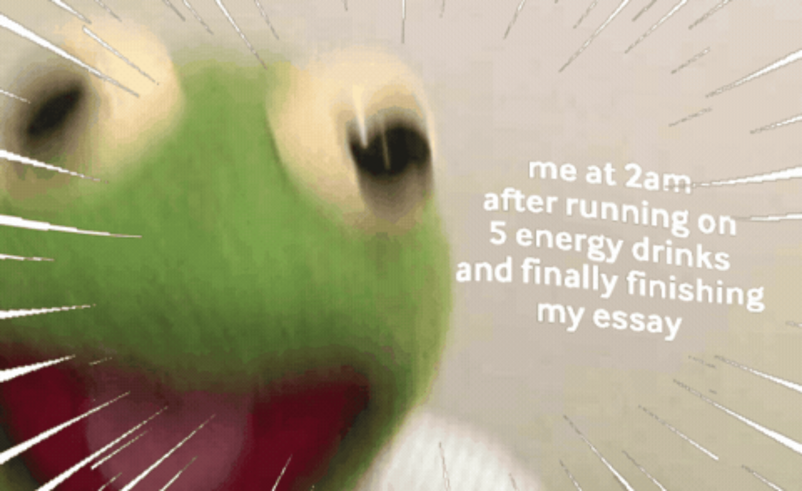

# Week 5, Make #4: GIF and Remix Culture

**Title:** *Outta there!*  
**Tools Used:** GIPHY

---

## The Artifact

The GIF shows a picture that moves in a continuous swirling motion. The subject remains the same, but the way the photo moves and the effects add dimension and movement. The loop lasts about 1 second and is continuous.

---

## Attribution & AI Use
- **Tool used:** GIPHY
- **What I changed/remixed:** I added in a meme description, the borders to better fit the vibe of the statement, and changed the timing of the effect.
